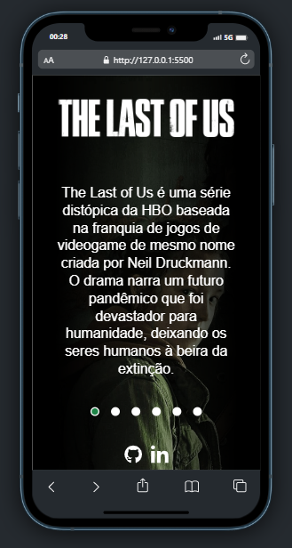

# The Last Of Us

Projeto realizado através da Semana do zero ao programador contratado, um evento realizado pela **[Dev em Dobro](https://github.com/devemdobro)**.

Você pode conferir o resultado **[aqui](https://josephmatheus.github.io/tlou-dev-em-dobro/)** 🚀

## 🖼 Screenshots

## 🛠 Construído com

- [HTML](https://developer.mozilla.org/en-US/docs/Web/HTML)
- [CSS](https://developer.mozilla.org/en-US/docs/Web/css)
- [JavaScript](https://developer.mozilla.org/en-US/docs/Web/javascript)

## ✍ Autor

<a href="https://www.github.com/josephmatheus">
    
    
Joseph Matheus

</a>

